# HTML

## HTML简介

HTML是用来描述网页的一种语言，被称为超文本标记语言！用HTML编写的文件，后缀以.html结尾 TML是一种标记语言，标记语言是一套标记标签。 标签是由尖括号包围的关键字。

***

盒模型：1.内容模型

          2.边框模型

HTML5的DOCTYPE声明（文档声明不区分大小写） DOCTYPE是document type（文档类型）的缩写。 是H5的声明位于文档的最前面，处于标签之前。 他是网页必备的组成部分，避免浏览器的怪异模式（不同游览器，代码呈现的效果可能不同）``<u></u><u></u><u>``<`!DOCT`YPE html>``</u><DOCTYPE htm1>``

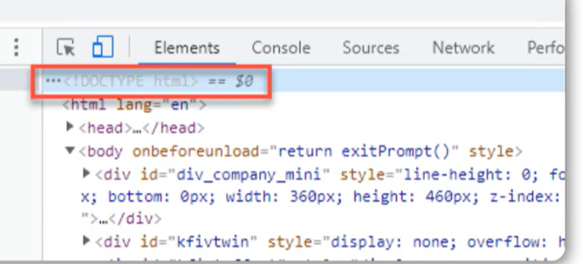

HTML5基本骨架

## HTML基础标签

**html标签** 定义HTML文档，这个元素我们浏览器看到后就明白这是个HTML文档了，所以你的其它元素要包裹在它里面，标签限定了文档的开始点和结束点。

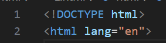

***

**head标签** head标签用于定义文档的头部。 文档的头部描述了文档的各种属性和信息，包括文档的标题、在Web中的位置以及和其他文档的关系等。 绝大多数文档头部包含的数据都不会真正作为内容显示给读者。`<u></u>`

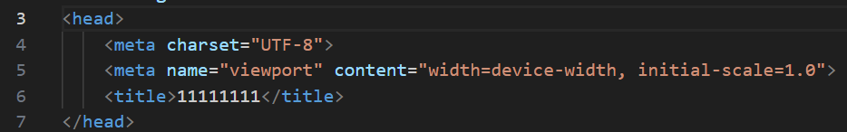

***

**body标签** body元素定义文档的主体。body元素包含文档的所有内容（比如文本、超链接、图像、表格和列表等等。 ） 它会直接在页面中显示出来，也就是用户可以直观看到的内容

***

**标题标签** 

1.可定义文档的标题。 

2.它显示在浏览器窗口的标题栏或状态栏上。

3.标签是标签中唯一必须要求包含的东西，就是说写head一定要写title里`<title><head>`

4.的增加有利于SEO优化 SEO是搜索引擎优化的英文缩写，通过对网站内容调整，满足搜索引擎的排名需求`<title>`

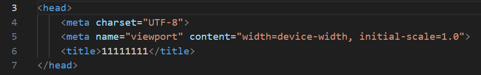

***

**meta标签**  meta标签（单标签）用来描述一个HTML网页文档的属性，关键词等，例如：charset=“utf-8”是说当前使用的是utf-8编码格式，在开发中我们经常会看到UT-8，或是gbk，这些都是编码格式，通常使用utf-8`<u></u><u></u>`

## 标题属性

**html5规定标签名一律小写** htm5不区分大小写

**一**.**属性定义注意事项：** 

1.属性名小写 

2.属性值要用双引号包裹 

3.属性名必须是字母开头，不能使用空格或者其 他除下划线、中横杠以外的特殊字符

**二**.**公共属性** 每一个标签都可以定义的属性：

1.id 定义唯一标识 

2.class定义类名 

3.name 定义名称 

4.style定义行内样式 

5.title定义划过气泡提示

**三**.**html注释**

<!-注释内容-> 支持单行多行，可以折行，如下：

`<!--注释内容-->`

快捷键ctrl+/

注意：注释不要嵌套注释

***

***

## 标题介绍与应用

标题（Heading）是通过-标签进行定义的。定义最大的标题，定义最小的标题`<h1><h6><h1><h6>`

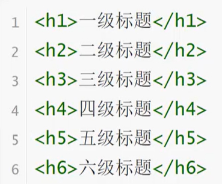

生成h1~h6快捷键：h$*6

正确使用标题 请确保将HTML标题标签只用于标题。不要仅仅是为了生成粗体或大号的文本而使用标题。正确使用标题有益于SE0 应该将用作主标题（最重要的），其后是(次重要的)，再其次是,以此类推`<h1><h2><h3>`

***

## 标签之段落（p）、换行（br）、水平线（hr）

**标签之段落** 段落是通过标签定义的`
`

文本写在p标签里方便设置其属性

` `

**换行（单表签）** 如果您希望在不产生一个新段落的情况下进行换行（新行），请使用。注意：元素是一个空的HTML元素。`  `

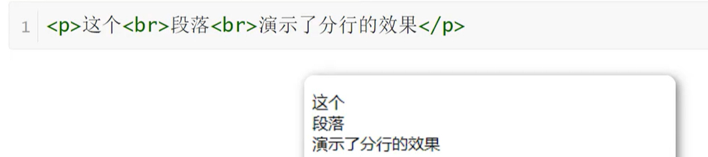

**水平线**

标签在HTML页面中创建水平线`
`

**属性：** 

1.color：设置水平线的颜色 

2.width：设置水平线的长度 

3.size：设置水平线的高度 

4.align：设置水平线的对齐方式（默认居中），可取值left|right

***

## 标签之图片

**网站中最多的元素** 网站中最多的元素毋庸置疑，一定是图片，标签定义HTML页面中的图像。``

注意：是单标签，不需要进行闭合操作``

**属性：**

1.src：路径（图片地址与名字）

 2.alt：规定图像的替代文本 

3.width：规定图像的宽度 

4.height：规定图像的高度 

5.title：鼠标悬停在图片上给予提示

***

***

## 图片路径详解

***绝对路径***

绝对路径是电脑的盘符存储与访问的具体地址
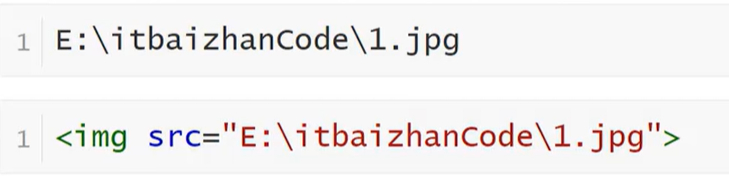

**相对路径** 两者相对关系，两者在同一路径下可以直接访问 1.子级关系：/ 2.父级关系：../ 3.同级关系：./

**网络路径** 具体的网络地址：http：/wenwiki.com/api/newworld/images/n1png

***

***

## 标签之超文本链接

**超链接描述**HTML使用标签来设置超文本链接 超链接可以是一个字，一个词，或者一组词，也可以是一幅图像，您可以点击这些内容来跳转到新的文档或者当前文档中的某个部分。`<a>`

**超链接属性** 在标签使用了href属性来描述链接的地址`<a>`

  默认情况下，链接将以，以下形式出现在浏览器中： 1.一个未访问过的链接显示为蓝色字体并带有下划线。2.访问过的链接显示为紫色并带有下划线。3.点击链接时，链接显示为红色并带有下划线。

**超链接表现** 当您把鼠标指针移动到网页中的某个链接上时，箭头会变为一只小手

***

## 标签之文本

**常用文本标签**

特别提示 常用文本标签和段落是不同的，段落代表一段文本，而文本标签一般表示文本词汇

***

## 列表标签之有序列表

**有序列表 **有序列表是一列项目，列表项目使用数字进行标记。有序列表始于标签。每个列表项始于标签。`<ol><li>`

**Type属性**

`<oi>`的属性type拥有的选项 1.1表示列表项目用数字标号（1,2,3....） 2.a表示列表项目用小写字母标号（a，b，c...）3.A表示列表项目用大写字母标号（A，B，C...） 4.i.表示列表项目用小写罗马数字标号（，ii，ii....）5.表示列表项目用大写罗马数字标号（I，II，III....）

**有序列表嵌套** 列表是可以进行嵌套（多次嵌套）的

***

***

## 列表标签之无序列表

**无序列表实现** 无序列表是一个项目的列表，此列项目使用粗体圆点（典型的小黑圆圈）进行标记 无序列表始于标签。每个列表项始于标签。`<ul>`

**type属性**   type拥有的选项 1.disc默认实心圆 2.circle空心圆 3.square小方块 4.none不显示`<u>`

**无序列表嵌套** 列表是可以进行嵌套的

**常见应用场景**

1.无序的列表效果 

2.导航效果 导航效果

**快捷键** 快速生成ul+li的布局：ul>li*3（数字根据自己的需要的li数量修改）

***

***

## 标签之表格

**表格展示效果** 表格在数据展示方面非常简单，并且表现优秀

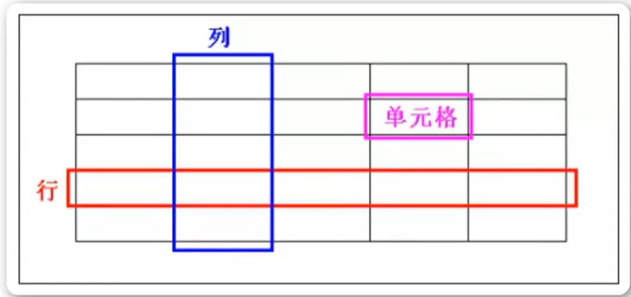

**表格组成与特点** 行、列、单元格 单元格特点：同行等高、同列等宽。表格标签 表格： 行： 单元格（列）：`<table><tr><td>`

***快捷键*** 快速生成表格结构：table>tr*2>td

**表格属性**1.border：设置表格的边框 2.width：设置表格的宽度 3.height：设置表格的高度

***

***

## 表格单元格合并

**单元格合并属性**

水平合并：colspan 

垂直合并：rowspan

挤掉

水平合并：保留左边，删除右边 垂直合并：保留上边，删除下边

先水平合并，在垂直合并

***

## 表单

表单在Web网页中用来给用户填写信息，从而能采用户信息，使网页具有交互的功能。 所有的用户输入内容的地方都用表单来写，如登录注册、搜索框

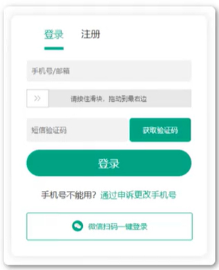

表单是由容器和控件组成的，一个表单一般应该包含用户填写信息的输入框，提交按钮等，这些输入框，按钮叫做控件，表单就是容器，它能够容纳各种各样的控件

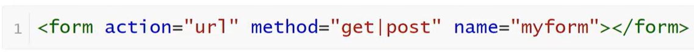

**属性说明** action服务器地址 name表单名称 method中Get和Post的区别 1.数据提交方式，get把提交的数据url可以看到，post看不到 2.get一般用于提交少量数据，post用来提交大量数据

**表单元素** 一个完整的表单包含三个基本组成部分：表单标签、表 1.表单标签 2.表单域 3.表单按钮

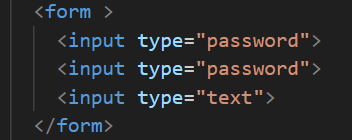

输入类型=“text”-----域

输入类型=“提交”-----按钮

***

***

## 表单元素

**文本框** 文本域通过标签来设定，当用户要在表单中键入字母、数字等内容时，就会用到文本域`<input type="text">`

**密码框** 密码字段通过标签来定义`<input type="password">`

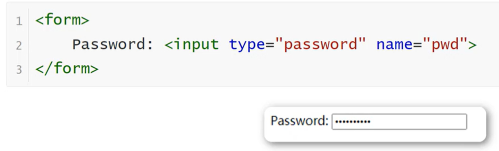

**温馨提示** 密码字段字符不会明文显示，而是以星号或圆点替代

**提交按钮 **当用户单击确认按钮时，表单的内容会被传送到另一个文件。表单的动作属性定义了目的文件的文件名。由动作属性定义的这个文件通常会对接收到的输入数据进行相关的处理.

***

***

## 块元素与行内元素(内联元素)

HTML5出现之前，经常把元素按照块级元素和内联元素来区分。在HTML5中，元素不再按照这种方式来区分，而是按照内容模型来区分，分为元数据型（metadata content）、区块型（sectioning content）、标题型（heading content）、文档流型（（flow content）、语句型（phraseing content）、内嵌型（embedded content，交互型（interactive content）。 元素不属于任何一个类别，被称为穿透的，元素可能属于不止一个类别，称为混合的

**内联元素和块级元素的区别**

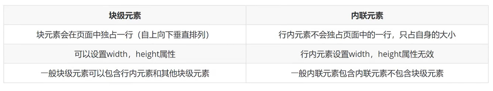

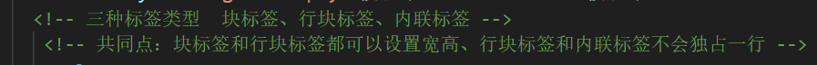

**常见块级元素**（换行，能够识别宽高） div、form、h1~h6、hr、p、table、ul、等 常

**见内联元素**（行内元素）（换行，不识别宽高） a、b、em、i、span、strongs等

**行内块级元素**（特点：不换行、能够识别宽高） button、img、inputs等

***

***

## HTML5新增标签

HTML5是HTML最新的修订版本，2014年10月由万维网联盟（W3C）完成标准制定

在HTML5出现之前，我们一般采用Div+Css布局我们的页面。 但是这样的布局方式不仅使我们的文档结构不够清晰，而且不利于搜索引擎爬虫对我们页面的爬取。 为了解决上述缺点，HTML5新增了很多新的语义化标签

**扩展知识**      div容器元素，也是页面中见到的最多的元素 div实现

**H5新标签实现**

**H5新标签**

1.头部 2.导航 3定义文档中的节，比如章节、页眉、页脚`<header></header><nav></nav><section>:</section>`

4.侧边栏 5.脚部 6.代表一个独立的、完整的相关内容块，例如一篇完整的论坛帖子，一篇博客文章，一个用户评论等`<aside></aside><footer></footer><article></article>`

