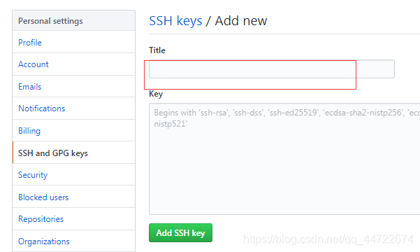
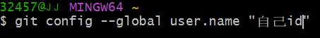
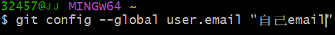
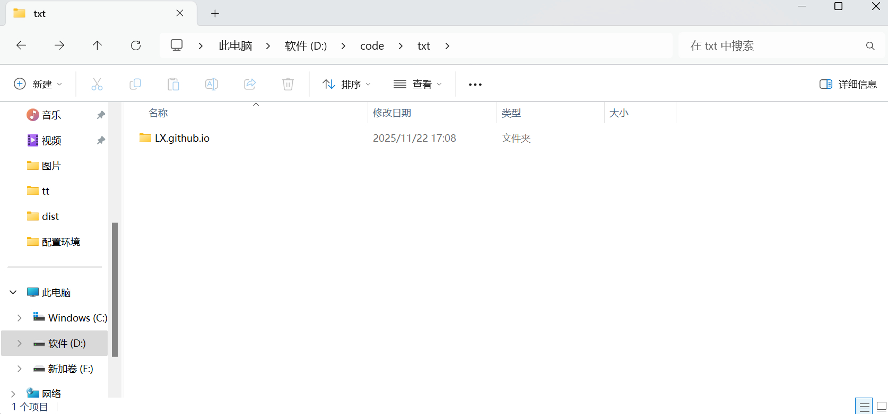
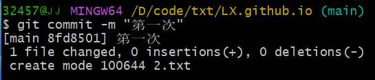
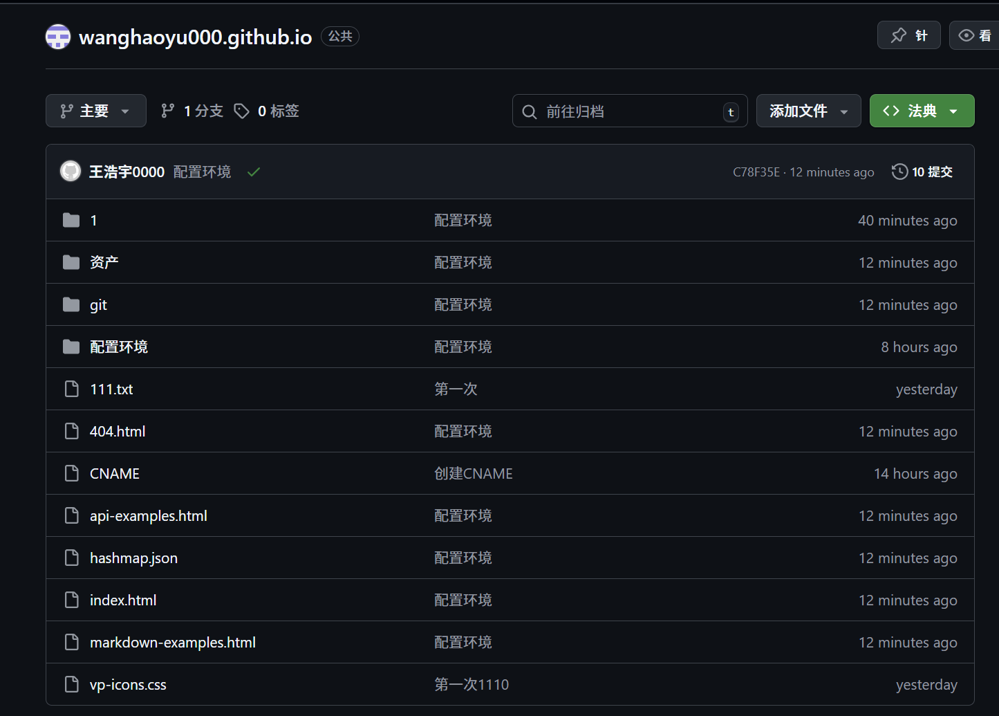

GitHub创建仓库

1.先去github创建一个自己的仓库

去Git的官网安装适合自己电脑的版本

2.获取密钥

首先要在本地创建一个 ssh key ，这个的目的就是你现在需要在你电脑上获得一个密匙，获取之后，在你的GitHub账号里边输入之后，你的电脑就和你的GitHub账号联系在一起了，这样以后就可以十分方便的通过Git bash随时上传你的代码。

双击打开gitbash，命令框里输入以下命令：

$ ssh-keygen -t rsa -C “你的email@.com”

注释：此处youremail@.com为你注册github时的邮箱

出现如图所示界面：

说明你的密匙已经成功创建了，现在打开上述的存储.ssh文件的位置，打开id_rsa.pub或是id_rsa文件，复制里面的内容（秘钥）：

注释：打开id_rsa.pub或是id_rsa文件，打开方式为记事本

注释：每个人密钥都不一样哦

如果没有显示密钥位置，自己手动去找，可以在c盘/users/用户名称（id）/.shh

找到带.ssh的文件点进去就可以看到了 如图打开中间下面的文件拓展名和隐藏的项目

打开自己的GitHub

找到SSH and GPG keys这个选项之后，在网页右上角点击new SSH Key按钮创建秘钥，title是你给你的秘钥起一个标题，key里面就把你刚才复制的秘钥粘贴进去，点击add SSH KEY就可以了：

之后再回到Git Bash，输入命令：$ ssh -T git@github.com ，再输入yes， 出现如下界面，就说明链接成功了

接下来还需要设置一些账号名，邮箱（email是一定要是注册GitHub的那个邮箱地址）

下面就要将你在github上创建的仓库克隆到你的本地来，方便以后进行代码上传。

打开你所创建的仓库：

然后再打开Git Bash，将自己的文件存储定位在一个你代码所要存储的位置，在这里，我将定位在D盘当中
#​将文件上传到仓库
出现如下界面，说明定位成功。

之后开始克隆一个仓库到本地：

Git 克隆 https://github.com/tzf6666/TZf6666.github.io.git

之后打开你所定位的D盘，就会出现一个跟你远程仓库一样的仓库文件夹：

打开这个文件夹，随意的创建一个文件，（在这个文件夹下你就可以上传代码了，在这里我保存了一个文件）

然后输入：ls命令，查看你目前所定位的文件夹中的文件：

然后输入命令：git add 文件名，引号里面是你所要上传的文件名称或者

然后在输入：git commit -m “描述内容，备注” ，输入之后出现以上情况（要有新的未上传的文件）：

然后在输入：git push origin master

出现上面界面，表示已经成功了。现在打开你的Github网站，找到你所创建的库：

