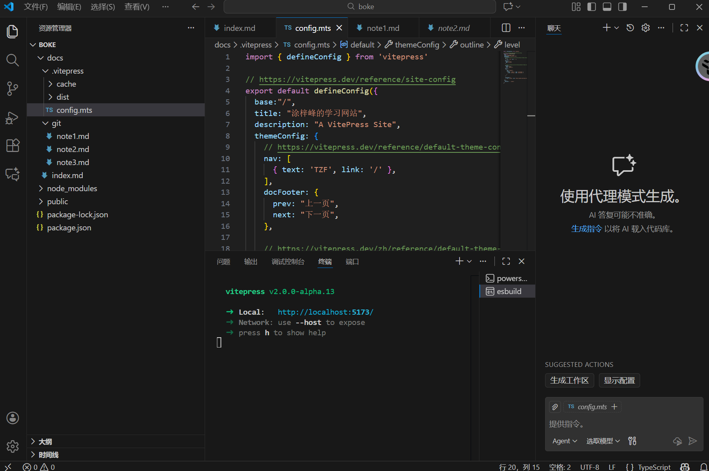
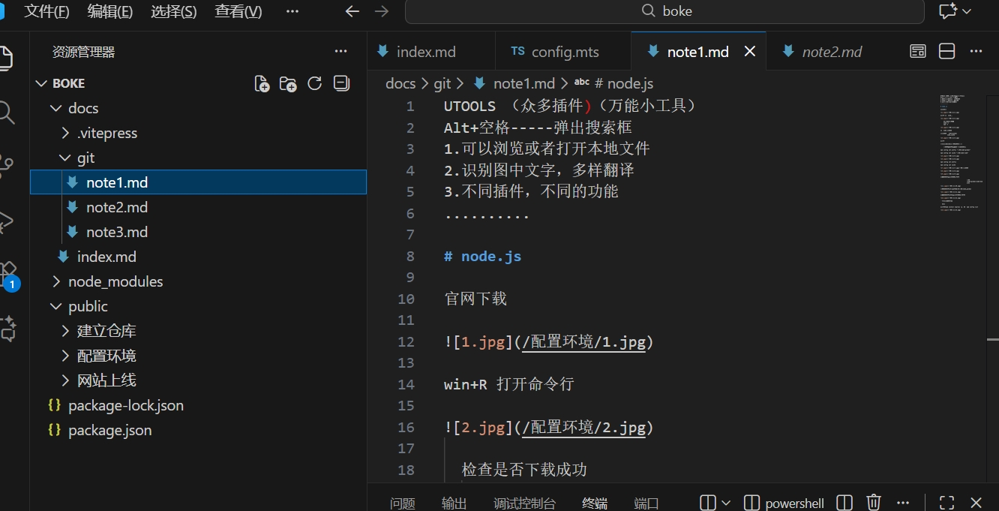
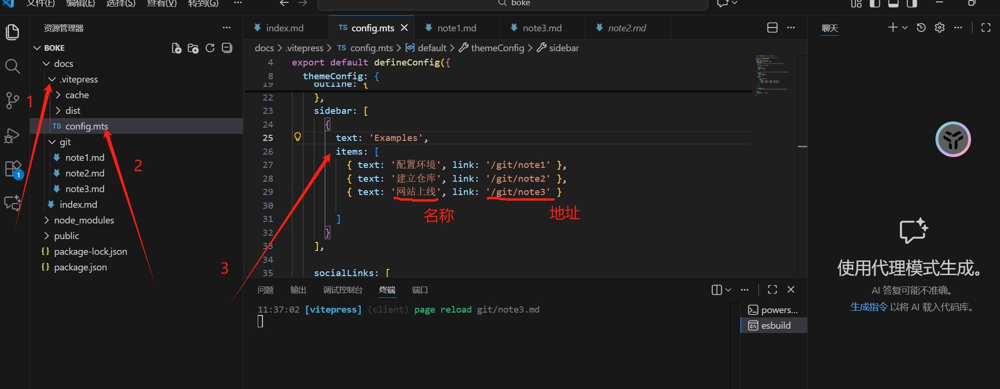
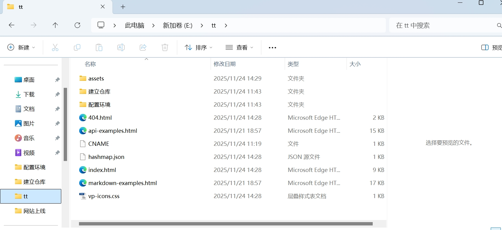
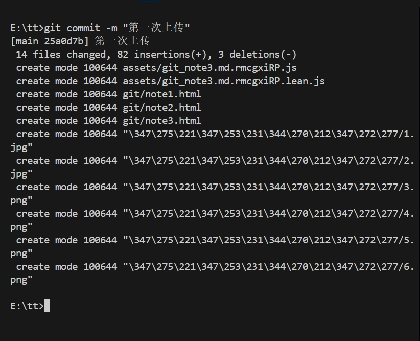
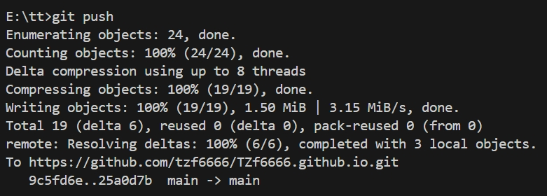

用vscode打开自己的boke文件夹（写代码的文件夹，点进去哦）：

在docs文件夹里面建立一个专门存放笔记的文件夹，图中专门存放笔记的文件夹叫git，

然后在专门存放笔记的文件夹里创建自己的笔记1、2、3......
创建好笔记以后，将Markdown的笔记传化为源码模式后，将代码复制

回到vscode将复制的代码粘贴到你vscode里创建的笔记文件里

打开 config.mts，找到items，添加你的笔记名称和链接如图所示

# **打包代码**

打开终端，在终端输入命令行：npm run docs：build

如图所示打包成功。

打开文件管理器，找到自己写代码的文件夹，根据下图所示的位置找到dist文件，将里面的文件和文件夹复制（这一步就是复制刚刚打包好的东西）

打开自己的本地仓库（图中的本地仓库为tt），将复制的东西全部粘贴到自己的本地仓库

粘贴完成后，用vscode打开自己的本地仓库，也就是你刚刚粘贴的地方，开始上传自己的笔记。
新建终端，打入以下指令：

**记得开猫猫云加速！！！！！**

git add 。

git commit -m “备注”

git pull

Git 推送

如图所示打开自己github的仓库

打开网站以后就可以看见自己的笔记了

