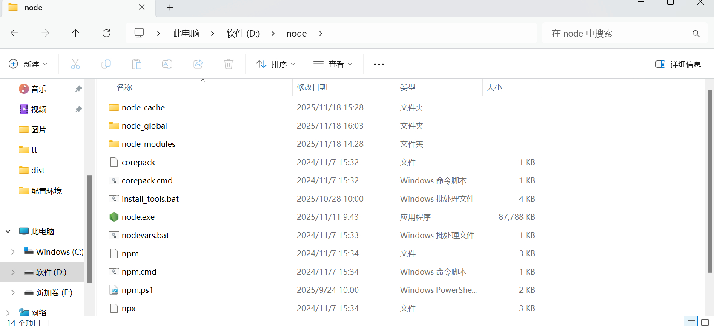
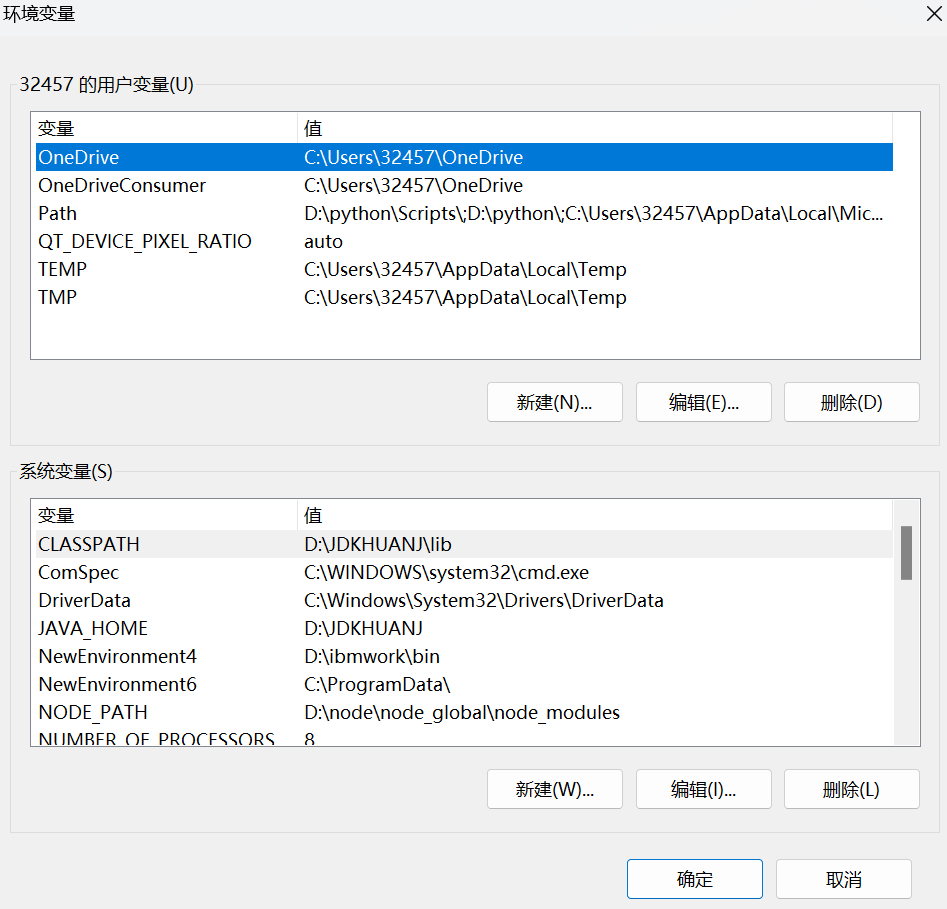

node.js

官网下载


win+R 打开命令行


检查是否下载成功 node -v npm -v


打开node.js文件

创建文件 node-global node_cache



win+R 

注释：cmd命令里路径不可有空格   

  路径地址要点到需要复制的文件里

 npm config set prefix "路径\node-global"

 npm config set cache "路径\node-code"


npm config set prefix 

npm config set cache


配置环境变量




系统变量——新建——NODE_PATH

路径\node-global\node-modules


用户变量——Path(npm编辑)——路径\node_global


系统变量——Path——新建——%NODE_PATH%


一直确定就可以了

检查：

```
win+R——npm install express -g 或 npm config list
```


